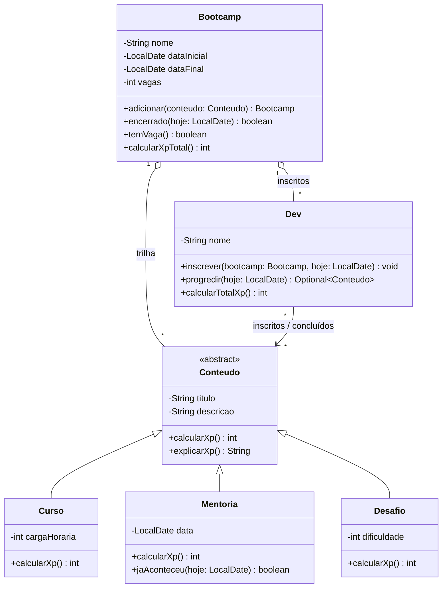

# Abstraindo um bootcamp com Orientação a Objetos em Java

[](https://github.com/barbozadevti/java-bootcamp-poo/actions/workflows/ci.yml)

Entrega do desafio de projeto **"Abstraindo um Bootcamp Usando Orientação a Objetos em Java"**, da [DIO](https://www.dio.me), sobre os quatro pilares da POO: **abstração, encapsulamento, herança e polimorfismo**.

> Versão ampliada para portfólio: **[barbozadevti/jornada](https://github.com/barbozadevti/jornada)**, uma plataforma de bootcamps no navegador (catálogo, matrícula, progresso com XP, ranking e certificado), com o mesmo domínio em Java 21 + Spring Boot e o diagrama UML conferido por testes.
>
> **Experimente:** [demo online](https://jornada-fk18.onrender.com) (hospedagem gratuita; o primeiro acesso pode levar cerca de 1 minuto) e [apresentação interativa](https://barbozadevti.github.io/jornada/) com a visão de recrutador e a de CEO.

## O problema

Um bootcamp oferece **conteúdos** de tipos diferentes (cursos, mentorias, desafios). Um **dev** se inscreve, vai concluindo os conteúdos em ordem e acumula **XP**, e cada tipo de conteúdo tem a sua conta de XP.



O diagrama também está em [`diagrama/bootcamp.mmd`](diagrama/bootcamp.mmd).

## Os quatro pilares no código

| Pilar | Onde aparece |
|---|---|
| **Abstração** | [`Conteudo`](src/Conteudo.java) é abstrata: define o que todo conteúdo tem (título, descrição) e o que cada um precisa saber fazer (`calcularXp`, `explicarXp`). Não existe "um conteúdo genérico". |
| **Herança** | [`Curso`](src/Curso.java), [`Mentoria`](src/Mentoria.java) e [`Desafio`](src/Desafio.java) herdam de `Conteudo` e acrescentam só o que é deles (carga horária, data, dificuldade). |
| **Polimorfismo** | Cada subclasse sobrescreve `calcularXp()`. [`Dev`](src/Dev.java) e [`Bootcamp`](src/Bootcamp.java) somam o XP de uma lista de `Conteudo` sem saber de que tipo é cada item. |
| **Encapsulamento** | Todos os campos são privados e imutáveis; as coleções são privadas e saem como visões somente-leitura (`Collections.unmodifiableSet`); não há setters; os construtores recusam dados inválidos. |

### Regras de XP

| Conteúdo | XP |
|---|---|
| `Curso` | 10 por hora de carga horária |
| `Mentoria` | 10 + 20 |
| `Desafio` | 10 + 15 × dificuldade (1 a 3) |

## O que evoluí em relação ao enunciado

- **`Desafio`**: um terceiro tipo de conteúdo, para mostrar que a hierarquia cresce sem mexer em `Dev` nem `Bootcamp`.
- **Trilha em ordem** (`LinkedHashSet`): `progredir()` conclui o próximo conteúdo da trilha e devolve um `Optional`.
- **Regras de inscrição**: bootcamp encerrado, sem vagas ou com o dev já inscrito são recusados.
- **Mentoria com data**: só pode ser concluída a partir do dia em que acontece (a data de hoje entra por parâmetro, o que deixa o código testável).
- **Igualdade por valor** em `Conteudo` e `Dev`, para não duplicar itens nos conjuntos.
- **`explicarXp()`**: mostra de onde vem cada pontuação.

## Como rodar

Requer o JDK 17 ou mais recente.

```bash
javac -encoding UTF-8 -d out src/*.java
java -cp out Main
```

```text
== Bootcamp Java Developer (240 XP no total) ==
  Curso "Java básico" (80 XP) -> 10 XP x 8 h
  Curso "Orientação a objetos" (60 XP) -> 10 XP x 6 h
  Mentoria "Mentoria de Java" (30 XP) -> 10 XP + 20 XP de mentoria
  Desafio "Abstraindo um bootcamp" (40 XP) -> 10 XP + 15 XP x dificuldade 2
  Mentoria "Mentoria de carreira" (30 XP) -> 10 XP + 20 XP de mentoria

== Camila progride ==
Concluiu: Java básico | XP: 80
Concluiu: Orientação a objetos | XP: 140
Concluiu: Mentoria de Java | XP: 170
Concluiu: Abstraindo um bootcamp | XP: 210
Bloqueado: A mentoria "Mentoria de carreira" só acontece em ...

== João progride ==
Concluiu: Java básico | XP: 80

== Regras ==
Inscrição recusada: O bootcamp Bootcamp Java Developer não tem mais vagas.
```

## Testes

```bash
bash tests/testar.sh
```

Sem bibliotecas externas: compila o código e roda 15 casos (hierarquia, XP de cada tipo, encapsulamento, regras de inscrição e da mentoria). Roda também no GitHub Actions a cada envio.
